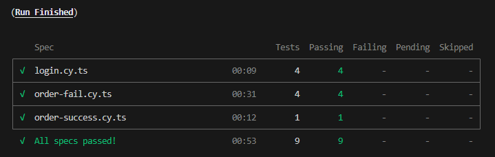

# LabOS Cypress Automation testing demo

This project contains Cypress tests for the [LabOS](https://qa-candidates.labos.cloud "LabOS") service, focusing on client web UI with backend verifications. \
The project is written with TypeScript and structured with the page-object-model design, along with tools, actions, assertions & workflows.

## Setup

* Install Node.js & npm [Installation guide](https://docs.npmjs.com/downloading-and-installing-node-js-and-npm "Downloading and installing Node.js and npm")
* Run `npm i`

## Running tests with one click

1. Run tests by running the `run-tests` script in `package.json`.

## Running tests with Cypress

1. Run the `open-cypress` script in `package.json`.
2. The Cypress app will open.
3. Choose E2E Testing.
4. Choose Browser.
5. Choose tests file to run.

## Project structure & important files

Important files:

* `cypress.config.ts` - Cypress specific configuration & Node events setup.
* `cypress.env.json` - Environment variables. *Note: Currently holds login credentials which usually should not be exposed.
* `cypress/support/e2e.ts` - This file runs before every single spec file - good for global hooks.
* `cypress/support/env.ts` - Assign & export the environment variables.

Cypress folders:

* `actions` - Generalized actions for reusability & maintainability.
* `e2e` - Holds spec test files
* `fixtures` - Load a fixed set of static data located in a file to be used in tests. 
* `verifications` - Generalized verifications for reusability & maintainability.
* `lab-os` - Code & data related to the application: Routes, Pages, Workflows, etc.
